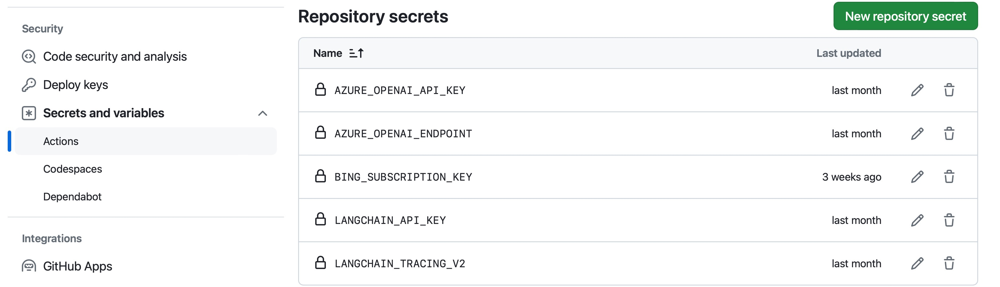

# LLMOps using LangSmith

The template is demonstrating the inner loop flow implementation using LangSmith, and it can be used as a background for LLMOps implementation.

The template includes:

-	**Utility scripts:** there are several scripts in the **mlops** folder that can generate dynamic names for projects and runs as well as interact with configuration settings.
-	**Configuration files:** primary configuration settings can be found in **config/config.yaml**, but some settings in the file depend on environment variables. The **.env.sample** file contains setting examples which cannot be hardcoded in **config.yaml** and they should be specified in the **.env** file to support local execution.
-	**Flow Examples:** the template has two different flows which are designed using Python SDK and LangChain SDK to demonstrate how to setup LangSmith in different cases. Each flow includes three scripts to demonstrate end to end development process:

    - **flow.py:** implementation of a tool or a chain that can be reused for testing and evaluation (and later for deployment).
    - **run_flow.py:** a script that tests the tool or chain on a set of hardcoded data. This script setup tracing capabilities (LangSmith), and it can be used to see if the flow or chain works in general.
    - **evaluate.py:** this script invokes evaluation on a dataset.

-	**DevOps workflows:** the template implements GitHub workflows. At this point Pull Request triggered workflows provided as a part of the template. Each PR workflow includes three main steps: execute quality checks (flake, unit tests), invoke the tool using run_flow.py script to test if its initial implementation works fine, invoke evaluation.py to run the tool on a set of data to collect some initial KPIs.
-	**Additional components:** to make sure that anybody can setup the template using existing configuration, we are providing the data folder with initial csv files, and **mlops/upload_data.py** can be used to initialize needed data sets in LangSmith. In real projects you are not supposed to store data in the repository and the script should be redesigned. The **upload_data_assets.yml** workflow can be utilized to initiate data set creation (or update) from GitHub.

To make sure that the flow can be executed in GitHub, the following secrets (they duplicate variables from .env.sample) should be provided:

-	**AZURE_OPEN_API_KEY:** Azure Open AI key that is required to get access to the model. Additional settings like deployment name and API version can be found in config.yaml.
-	**AZURE_OPENAI_ENDPOINT:** Azure Open AI endpoint url to get access to the service.
-	**BING_SUBSCRIPTION_KEY:** In our examples (LangChain implementation) we are using Bing API that should be deployed as a part of Azure resource group. This key is required to get access to the API.
-	**LANGCHAIN_API_KEY:** LangSmith key to get access to the LangSmith environment through its API.
-	**LANGCHAIN_TRACING_V2:** it’s possible to use this flag to switch on or off the traces into LangSmith. This feature works for LangChain tools only, but Python implementation can check it explicitly and activate tracing based on that.

## Contributing

This project welcomes contributions and suggestions.  Most contributions require you to agree to a
Contributor License Agreement (CLA) declaring that you have the right to, and actually do, grant us
the rights to use your contribution. For details, visit https://cla.opensource.microsoft.com.

When you submit a pull request, a CLA bot will automatically determine whether you need to provide
a CLA and decorate the PR appropriately (e.g., status check, comment). Simply follow the instructions
provided by the bot. You will only need to do this once across all repos using our CLA.

This project has adopted the [Microsoft Open Source Code of Conduct](https://opensource.microsoft.com/codeofconduct/).
For more information see the [Code of Conduct FAQ](https://opensource.microsoft.com/codeofconduct/faq/) or
contact [opencode@microsoft.com](mailto:opencode@microsoft.com) with any additional questions or comments.

## Trademarks

This project may contain trademarks or logos for projects, products, or services. Authorized use of Microsoft 
trademarks or logos is subject to and must follow 
[Microsoft's Trademark & Brand Guidelines](https://www.microsoft.com/en-us/legal/intellectualproperty/trademarks/usage/general).
Use of Microsoft trademarks or logos in modified versions of this project must not cause confusion or imply Microsoft sponsorship.
Any use of third-party trademarks or logos are subject to those third-party's policies.
